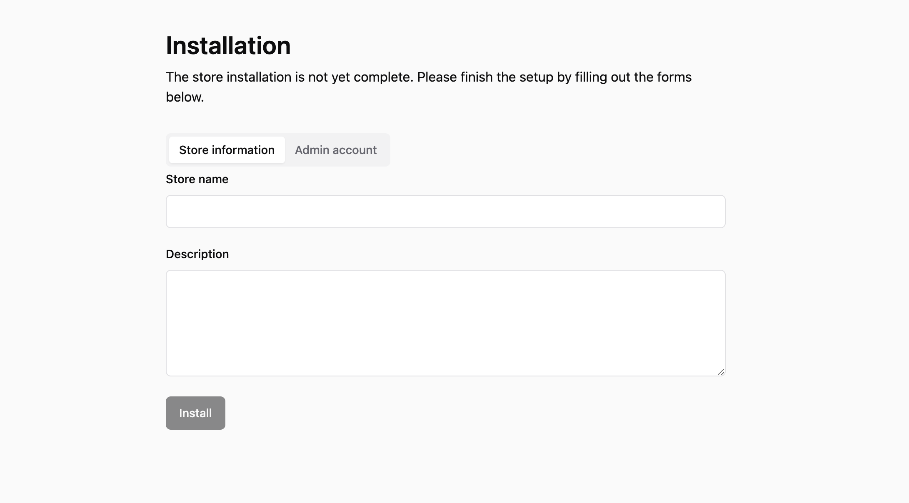

#  Cachaca

[](https://github.com/ccwukong/Cachaca/actions/workflows/demo.yml)

A GenAI-embedded open source e-commerce solution.

You can also reach out to me via the [Discord channel](https://discord.com/invite/GJJ3pU7BdN)

The project is developed on top of:

- [Remix](https://remix.run/)
- [Tailwind](https://tailwindcss.com/)
- [Shadcn](https://ui.shadcn.com/)
- [Drizzle](https://orm.drizzle.team/)

## Table of Contents

- [Demo](#demo)
  - [Demo accounts](#demo-accounts)
  - [Store installation](#store-installation)
- [RC1 roadmap](#rc1-roadmap)
  - [System](#system)
  - [Admin dashboard](#admin-dashboard)
  - [Storefront](#storefront)
- [Development](#development)
  - [Development environment](#development-environment)
  - [Database](#database)
  - [File hosting](#file-hosting)
  - [i18n localization](#i18n-localization)
  - [Customization](#customization)
    - [Creating a new theme](#creating-a-new-theme)
  - [Unit test](#unit-test)
- [Deployment](#deployment)
  - [Web hosting](#web-hosting)
  - [Database hosting](#database-hosting)
- [License](#license)
- [Attribution](#attribution)

## Demo

**Note**: This project is still at its very early stage. I'm currently working on the frontend development with all the mock data. No backend services is ready at the moment.

🐞 **[Common issues and solutions](https://github.com/ccwukong/Cachaca/discussions/11)**

### Store installation

If you start fresh, you will see the **Installation** screen below. Please ensure the store is properly installed by providing the required information for **Store information** and **Admin account**



### Demo accounts

[Storefront](https://main--roaring-gnome-50b6e1.netlify.app/)

- Email: customer@test.com
- Password: 123456

[Store admin dashboard](https://main--roaring-gnome-50b6e1.netlify.app/admin)

- Email: admin@test.com
- Password: 123456

## RC1 roadmap

### System

- [x] Store installation
- [x] DB connection check, promps error message if DB connection isn't estabilished
- [ ] Integration with Cloudinary for image hosting
- [x] Email service provider integration for transactional emails
- [ ] Email service provider integration for marketing emails
- [ ] OpenAI integration
- [ ] Add TiDB and Netlify integration as default option for pre-installation
- [ ] System log

### Admin dashboard

- [x] Admin account login
- [ ] User management
  - [ ] Role-based permission management
- [ ] Customer management
- [ ] Product management
  - [ ] Product category and sub-category management
  - [ ] Product variant management
  - [ ] Product collection management, such as editor's pick etc.
  - [ ] Product discount
- [ ] Product review management
- [ ] Order management
  - [ ] Shipping module integration (need more research)
  - [ ] Refund and partial refund management
  - [ ] Voucher management
- [ ] Store management
  - [ ] Store banners
  - [ ] Public pages
  - [ ] Store public info, such as logo, store name etc.
  - [ ] Third party API credentials
- [ ] Payment integration
  - [ ] Stripe integration
  - [ ] Cash on delivery
- [ ] AI features
  - [ ] Prompt management
  - [ ] Creating new product
  - [ ] Creating ads campaigns
  - [ ] Sentiment analysis from product reviews

### Storefront

- [x] Displaying public page content, such as about us, terms etc.
- [x] Displaying product banners on homepage.
- [ ] Displaying product collections on homepage
- [ ] Product review on product detail page
- [ ] Checkout page and Payment page (currently, the cart items are stored in indexedDB at frontent, need to sync this to server later)
- [x] Customer account login
- [x] Customer account registration
- [ ] Customer account reset password
- [ ] Customer order management
- [ ] Customer account management

## Development

### Development environment

- Node.js >= 18.0.0
- MySQL 8
- Remix v2

Run the dev server:

```shellscript
yarn dev
```

### Database

We use MySQL database as the default database. It's recommended to use Docker containers for your local development to ensure consistency of development environment among contributors.

To set up the database using Docker, first make sure you have the database environment variables configured in your **.env** file under the root directory.

Then, you can run the following command:

```shellscript
docker compose up -d
```

The default template of the **.env** file

```
DB_HOST=localhost
DB_PORT=3306
DB_USER=root
DB_PASS=<database user password>
DB_NAME=<database name>
JWT_TOKEN_SECRET=<a long random string that is used to sign JWT auth token>
SESSION_COOKIE_SECRET=<a long random string that is used to sign cookie message>
```

### File hosting

Cachaca is designed to be deployed in different environments including Serverless environments, therefore, it is our design decision to use a file/object hosting service to host all multimedia files such as product images, audio/video files etc.

By default, Cachaca uses [Cloudinary](https://cloudinary.com/pricing) as it provides a free tier and friendly integration.

You can also use other file/object storage service providers by customizing the integration yourself:

- [AWS S3](https://aws.amazon.com/s3/) - 12 months free tier available
- [Google cloud storage](https://cloud.google.com/storage/pricing#price-tables)
- Many more...

### i18n localization

We use the **remix-i18next** package. To add a translation item, you should:

1. Create a new **<language code>.json** file under the _**/public/i18n/**_ directory if the file does not exist yet, and make sure you copy all the translation keys from the _**/public/i18n/en.json**_ file. For example, to add Japanese as a new language, you need to create **ja.json** under the _**/public/i18n/**_ directory, and make sure to copy all the tranlation keys from _**/public/i18n/en.json**_ file to the new **ja.json** file.

2. Follow the naming convention for the translation keys:

   - All pre-defined translation keys have the **system.** prefix, for example, **system.login** is translated as **Login** in English. These keys are used for the static instructions/description of the UI components.

   - If you wish to add your own UI components with new translation items, please use the prefix **custom.**. For instance, if you want to add translation for the word **Dropshipping**, you should add a new key `{"custom.dropshipping": "Dropshipping"}` in the translation.json files.

3. Add the new language code as a supported language in the **/app/i18n.ts** file.

### Customization

Cachaca allows you to develop your own themes and plugins on top of default UI components and features to a great extent. However, there are a few development guidelines you should adopt in order to keep this project scalable and maintainable.

#### Creating a new theme

If you wish to create a custom theme for any reasons, you shall follow the guidelines below:

- Create a new directory under the **/app/themes** directory with the name of your theme, for instance, if you want to create a new theme called **Urban**, you should create a new directory named **urban** _**(all theme names should be in lower case)**_ and the directory structure will look like this **/app/themes/urban**.

- In your own theme directory, you should separate your UI components into **components** and **pages**, where components consists of common React UI components and shadcn components, and pages directory consists of container components of each **Route**, for instance, one of the pre-defined routes **/app/routes/cart.tsx** invokes the **<Cart {...props} />** container component from the **/app/themes/default/pages/storefront/Cart.tsx** file.

- If you only wanted to customize the UI components for storefront, and use the default components from the **default** theme, you can copy the rest of the directories and files into your own theme directory.

- Make sure you add all the new translation keys under the **/public/i18n/** directory accordingly.

### Unit test

It's important to ensure the UI components and backend services are well tested. We aim to achieve **90%** test coverage for the entire codebase for RC1.

For Frontend, we use [React Testing Library](https://testing-library.com/docs/react-testing-library/intro/) for component testing

For Backend, we rely on Jest built-in functions + our own [mockdata](./mockdata/) for function and model testing

## Deployment

If you plan to host the system mannually, you can simply configure the environment variable in your server, and

- Build your app for production:

```sh
yarn build
```

- Run the app in production mode:

```sh
yarn start
```

You are recommended to use our auto deployment feature (WIP), and you can easily deploy your store within a minutes.

Some recommended painless **Serverless** options:

### Web hosting

- [Netlify](https://www.netlify.com/) - The demo app is currenlty running on Netlify's free-tier

### Database hosting

- [TiDB serverless](https://www.pingcap.com/tidb-serverless/) - A MySQL compatible serverless database service provider, the demo database is currently running on TiDB's free-tier

## License

[Open Software License ("OSL") v. 3.0](LICENSE)

## Attribution

- The dummy product photos/images that are used for development and demo purposes are from [https://www.pexels.com/](https://www.pexels.com/)

- The logo/icon of Cachaca project is from [https://www.freepik.com/](https://www.freepik.com/)
